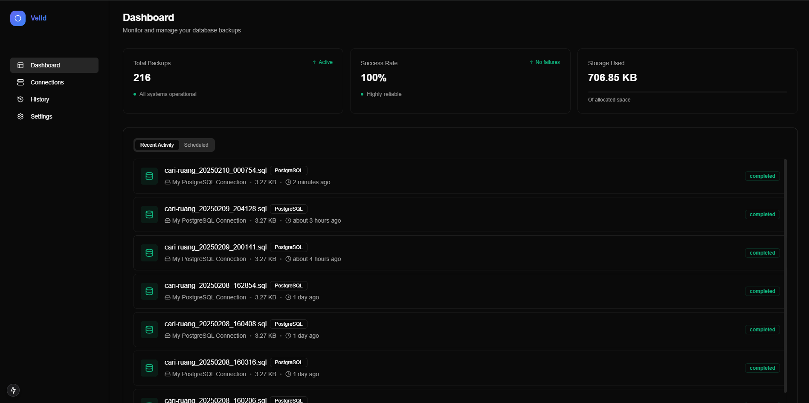

# Velld

A database backup management and automation tool. Velld provides a user-friendly interface for scheduling, managing, and monitoring database backups, ensuring data security and easy recovery.

## Features

- 🗄️ Support for multiple database types
- ⏰ Automated backup scheduling
- 🔔 Notifications system

## Screenshots

#### Dashboard Overview

Monitor backup statistics and recent activities.

#### Connection Management

Easily manage multiple database connections.

#### History

View detailed backup history and logs.

## Currently Supported Databases

- **PostgreSQL**
- **MySQL**
- **MongoDB**

*More databases will be supported in future releases.*

## Installation

### Using Docker

```sh
# Clone the repository
git clone https://github.com/dendianugerah/velld.git

# Navigate to the project directory
cd velld

# Start the application
docker compose up -d
```

Once started, the application will be available at:
- **Web Interface**: http://localhost:3000
- **API**: http://localhost:8080

## Configuration

### Backend Configuration (`apps/api/.env`)

```env
# Authentication
JWT_SECRET=your-jwt-secret
ENCRYPTION_KEY=your-encryption-key
```

### Frontend Configuration (`apps/web/.env`)

```env
# API Connection
NEXT_PUBLIC_API_URL=http://localhost:8080
```

## Development Setup

### Prerequisites

- **Go**
- **Node.js**

### Running API Locally

```sh
cd apps/api
go mod download
go run cmd/api-server/main.go
```

### Running Web UI Locally

```sh
cd apps/web
npm install
npm run dev
```

## Contribution

Contributions are welcome! If you find a bug or have a feature request, please open an issue or submit a pull request.

### Guidelines

1. Fork the repository and create a new branch.
2. Make your changes and ensure tests pass.
3. Submit a pull request with a clear description of the change.
